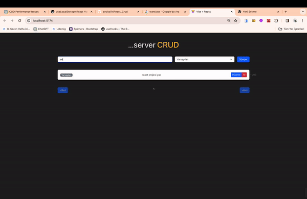

<h1> React-ServerCrud </h1>

This project includes a simple note-taking application. Users can add, edit, and delete notes through the application. Additionally, they can list notes with a pagination feature.

<h2> The technologies used in the project </h2>

.React: React library is used for the user interface.
.Axios: Axios library is used for HTTP requests.
.Bootstrap: Bootstrap is used for basic style and layout.
.JSON Server: JSON Server is used to provide a simple API for the project.

<h2> Demo </h2>

You can view a live demo of this project [here](https://react-servercrud.netlify.app).

<h2> Screenshot </h2>

# React_ServerCrud
